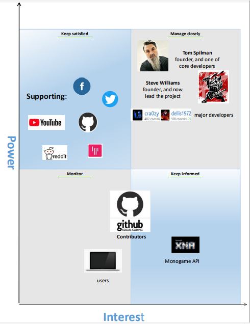
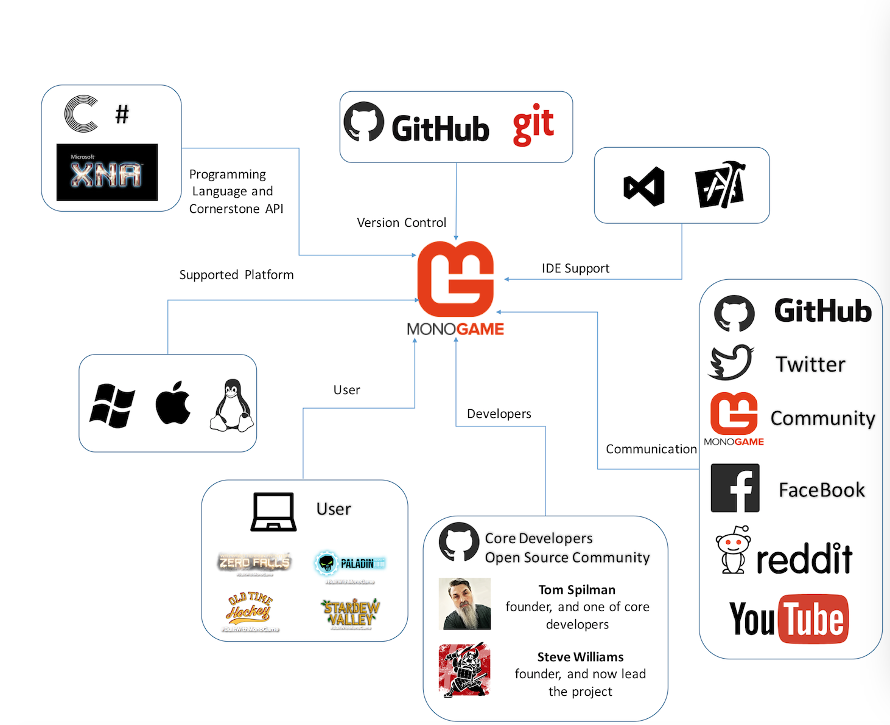
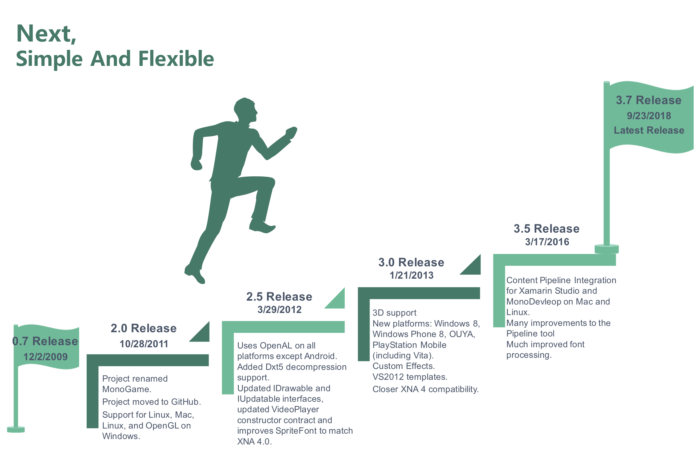
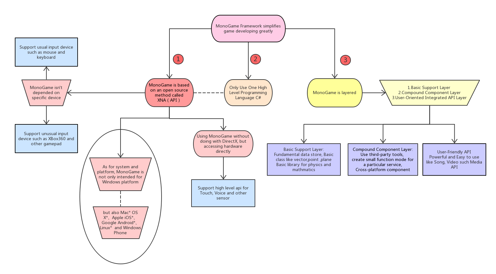

MONOGAME 
========== 
### One Framework For Creating Powerful Cross-platform Games


-------------

## Abstract

Monogame is a cross-platform, hardware accelerated API providing graphics, audio, game state management, input, and a content pipeline for importing assets. Unlike most game engines, monogame does not provide or impose any pattern or project structure. While this means that developers are free to organize their code as they like, it also means that a bit of setup code is needed when first starting a new project. The open source project started from 2009, created by an active member of the XNA community with the goal of porting simple 2D XNA games to mobile devices. In early 2014 stewardship of the MonoGame project was handed off to Tom Spilman and Steve Williams who currently lead the project. Now it contains 11,910 commits, has released 13 times and 251 different contributors have helped to perfect the monogame. By using MonoGame and targeting the UWP platform you’ll be able to create 2d and 3d games for hundreds of millions of Windows 10 PCs and the whole Xbox One family, including the upcoming Project Scorpio. This	chapter	studies Monogame	by	looking	at	its	architecture,	and	by	looking	at	the	system	through	different viewpoints	and	perspectives.


## Table of contents
- [Introduction](#introduction)
- [Stakeholders](#stakeholders)
- [Quality Attributes](#quality-attributes)
- [Context view](#context-view)
- [Evolution view](#evolution-view)
- [Logical view](#logical-view)
- [Development view](#development-view)
- [Deployment view](#deployment-view)
- [Earlier decisions](#earlier-decisions)
- [Technical debt](#technical-debt)
- [Conclusion](#conclusion)
- [References](#references)


## Introduction

#### 1.What is the monogame

MonoGame is an Open Source implementation of the Microsoft XNA 4 Framework. Our goal is to allow people to make great games using a simple API.
MonoGame also supports a number of Game Consoles. The templates and source for these platforms are not publicly availalbe. However they are available to developers registered with the appropriate developer programs.

#### 2.History

In 2009 José Antonio Leal de Farias, an active member of the XNA community, started an open source project called XNA Touch with the goal of porting simple 2D XNA games to mobile devices.  He started from Bill Reiss’s SilverSprite and some bits of Mono.XNA and in December 2009 the first release which only supported iPhone was posted on Codeplex.

Over 2010 several iPhone games appeared on the Apple App Store which used XNA Touch.

In March 2011 the project was renamed MonoGame and was moved to GitHub.  That same year support for Android, Mac, Linux, and OpenGL on Windows appeared.  Dominique Louis who joined the project in 2009 took over as the full time project lead.

Early 2012 saw the addition of the DirectX 11 backend and support for Windows 8 providing the first and currently only way to port XNA games to the Windows Store.  This subsequently spawned support for Windows Phone 8 and a new Windows desktop platform.  This same year MonoGame team was invited to speak at Microsoft’s //Build 2012 event.

Microsoft Studios published several titles using MonoGame in 2013 on Windows 8 and Windows Phone 8. 2013 also saw the announcement of the first MonoGame titles coming to PlayStation 4 including TowerFall Ascension, Transistor, and Mercenary Kings.

In early 2014 stewardship of the MonoGame project was handed off to Tom Spilman and Steve Williams who currently lead the project.


## Stakeholders

We will describe a number of different	types of stakeholders exist as defined by Rozanski & Woods [1] 
and relate our views of the classes in relation to the monogame project. 
In early 2014 stewardship of the MonoGame project was handed off to Tom Spilman and Steve Williams who currently lead the project.

- Project Leads：
   - Steve Williams
   - Tom Spilman

- Developers：
   - Steve Williams,  Tom Spilman, Dean Ellis, Marko Jeremic

- Developer Emeriti：
   - José Antonio Leal de Farias, Dominique Louis, Kenneth Pouncey, Andrea Magnorsky, Jacob Anderson

- Evangelists：
   - Dominique Louis (London, UK), Andrea Magnorsky (Dublin, IE), Bill Reiss (Tampa, US), Shmuel Englard (New Jersey, US), 
   - Kowsheek Mahmood (Toronto, CA), Chris Foster (Tucson, US), Hüseyin Uslu (Ankara, TR), Giovanni Colì (Apulia, IT), 
   - Joe Stead (York, UK), Randolph Burt (Kent, UK), Tomáš Slavíček (Prague, CZ), Artem Veselovsky (Lviv, UA), 
   - Deniz Opal (Istanbul, TR), Alexandre Z. Chohfi (São Paulo, BR)

- Users：
   - The major user of Monogame is individual developers. Their concrete names are hard to find. There are some prominent productions such as Stardewvalley, Pumpkin Games, Apotheon.etc

Table1:Most	active	contributors	in	trems	of	number	of	commits

 Contributor | Commits | LOC++ | LOC-- | Active during 
 ----|----|----|----|----
 Tom Spilman | 1,772 |	701,065 |	321,854	| 2011-present 
 Dean Ellis | 439 | 53,504 |	29,368 | 2011-present 
 Harry	| 398 |	43,394 |	46,065 |	2014-present 
 Ray Batts |	292 |	50,512 |	26,945 |	2011-2014 
 Dominique Louis |	289 |	44,200 |	28,932 |	2010-2013 
 Kenneth Pouncey |	283 |	47,495 |	16,676 |	2010-2015 
 Dave Leaver |	279 |	17,502 |	18,801 |	2011-2015 
 Steve 'Sly' Williams |	261 |	37,566 |	25,480 |	2011-present 
 Adam Kapos	| 244	| 11,329	| 8,752	| 2012-2015 
 Yuri Roubinski	| 220 |	13,603	| 7,283 | 2012-2015 



Figure 1: Power Interest Graph of Monogame

- Explanation
   - Manage closely: This part of Power Interst Graph includes the major developers as well as the leaders. They are definitely the ones that contribute to the project most and that pay most attention to the work.
   - Keep satisified: This part is consisted of the supporters of the project who provide most help to the project but are less interested in it.
   - Monitor: The monitor is the users that use this structure to develop games. They only care about how to use the project and do not think about the development of the project, but it is improtant to satisify their requirement, which means they are exactly the ones that tell developers what to do.
   - Keep informed: It is mentioned in this paper that Monogame depends on XNA structure, so the developers must keep them known about which part of XNA has been used.

## Quality attributes

It is known that MonoGame is a software structure that focus on C# game developing, so the table below illustrates six scenario of MonoGame quality attributes:

Table2: Quality attributes analysis

Quality Attribute	| scenery	| stimulus	| stimulation	| product	| environment	| response
-----|-----|-----|-----|-----|-----|-----
Availability	| A Linux user wants to develop a game using MonoGame	| A game developer	| Using Linux operating system	| A optimized structure MonoGame that can support Linux system	| Normal operation	| Record the requirement and respond to the public to look for solution
Mutability	| Add a new function for the structure or perfect current system	| Developers and other contributors	| Further need for the functions of the structure	| A better usable structure MonoGame |	During testing, designing and running	| Find the part to be changed, and test after changing
Performance	| A game using MonoGame as its structure can not perform quickly	| From inside the structure	| Gamer’s operation arrives	| A higher speed structure and optimized algorithms	| Override pattern	| Handle the stimulation
Security	| A attacker is trying to rewrite the major part of the structure.(Since MonoGame is a open-source structure)	| Attackers | An attempt to change structure data | Safety defender will start to work for the structure	| Online attack	| Main leaders of the structure stop the attacker and repair the structure
Testability	| After a new part of the structure were developed	| Developers and testers	| A newly developed structure |	A new version of the structure	| During designing, developing and deploying	| Test again and again
Usability	| A game developer is trying to figure out how to use MonoGame to develop a game	| Game developers	| An attempt to get familiar to the structure	| A user guide website	| During developing time	| Develop a web to introduce MonoGame and release a series of tutorials

## Context view

The context view describes the relationships, dependencies, and interactions between the system and its environment(the people, systems, and external entities with which it interacts). This section examines Monogame's scope, its dependencies on others and the interaction with other parties.

### System scope & Responsibilities

MonoGame is an Open Source implementation of the Microsoft XNA 4 Framework. Our goal is to allow XNA developers on Xbox 360, Windows & Windows Phone to port their games to the iOS, Android, Mac OS X, Linux and Windows 8/10.As well as PlayStation Vita, Xbox One and PlayStation 4. As a pioneer of framworks for creating cross-platform games, MonoGame possesses 4 prominent advantages. 

#### Managed Code 

By leveraging C# and other .NET languages on Microsoft and Mono platforms you can write modern, fast, and reliable game code.

#### Cross-Platform

Monogame currently supports iOS, Android, MacOS, Linux, all Windows platforms, PS4, PSVita, Xbox One, and Switch with more platforms on the way.

#### Open-Source

All the code is available to programmer ensuring them'll have the ability to make changes when they need to or even port to whole new platforms.

#### Community

With 1000s of shipped games we have built up a vibrant community of developers which use MonoGame for both fun and profit.

### Operating System

MonoGame is an Open Source implementation of the Microsoft XNA 4 Framework, it is an open source spiritual successor to XNA, now supports over 10 platforms including UWP.
The currently supported platforms are as follows.
* Desktop PCs   
   * Windows 10 Store Apps (UWP)
   * Windows Win32 (OpenGL & DirectX)
   * Linux (OpenGL)
   * Mac OS X (OpenGL)

* Mobile/Tablet Devices   
   * Android (OpenGL)
   * iPhone/iPad (OpenGL)
   * Windows Phone 10
   * Television
   * tvOS

### System Requirements

This section will give you an overview of minimal system requirements for developing and running MonoGame Applications.

#### Development
* Windows - 
* Linux - 1 GB Ram
* Mac - 
#### Running MonoGame Application on specific Platform
* WindowsDX - DirectX 9.0c capable gpu
* WindowsGL - 
* Linux - 512 MB Ram
* Mac -
* Android - Android 4.2 or higher
* iOS -
* Windows Phone - Windows Phone 10

### Setting Up Monogame
This section will help you setup MonoGame on Platform of your choice.
#### Windows
* Visual Studio is an IDE used to develop applications in, among other languages, C#. C# is the most common language used in MonoGame development.
#### Mac
* Make sure you install mono and Visual Studio for Mac first so that MonoGame can correctly setup the project templates and addins.
#### Linux
* The following packages are needed for the MonoGame Applications to run on Linux:
   * libopenal-dev
   * mono-runtime


Figure 2: Context view.

#### External entities and interfaces

Monogame is a widely-used framework to build cross-platform games. As one can imagine, a software project like this cannot be developed without external libraries, tools and frameworks. On the other hand, many companies cannot develop their game without Monogame. These external relations are examined in this section. Below, these are elaborated upon.

- MonoGame follows the open-source standards of XNA API
- 4.0 XNA API is based on .NET Framework 4.0 and platform, Visual Studio 2012. As a result, MonoGame is written in C#.
- Active development team of 30-40 core developers and more than 200 contributors from the open source community
- The major user of Monogame is individual developers. There are some prominent productions such as Stardewvalley, Pumpkin Games, Apotheon.etc

- A Githubu repository filled with code, plugins and many issues is used to host the code base
- Communication and support is provided via Github, Facebook, Tiwtter, YouTube and its own community.


Figure 3: Shows external links to several useful reference sites related to Monogame. 

## Evolution View

This section analyses the evolution of the Monogame Framework. The evolution perspective focuses on identifying the ability to be flexible in the face of inevitable change. As discussed by Rozanski and Woods, a flexible system should be able to deal with all possible types of changes that it may experience during its lifetime. Therefore, the changes throughout the lifetime of the project are analyses, and the mechanisms in place to provide flexibility are discussed.

MonoGame updates their current version number according to the semantic versioning convention. Most MonoGame releases can be categorised into two main categories: major updates that symbolize a new backwards compatibility baseline, and new versions containing novel features and bug fixes. The first one corresponds to the major indicator in the semantic version convension, the latter corresponds to the minor type. There might also be a version number that represents a patch, which is incremented by small bug fixes that are merged into the Master branch.

The first type has only occurred three times in the history of MonoGame. The latter on the other hand, has an average frequency between 1-2 years. Figure 5 give an overview of the different release and mentions the changes with the largest magnitude of change.


Figure 4: Evolution view.

But the most biggest change showed in the version3.0. The changes are as followed.
* 3D (many thanks to Infinite Flight Studios for the code and Sickhead Games in taking the time to merge the code in)
* New platforms: Windows 8, Windows Phone 8, OUYA, PlayStation Mobile (including Vita)
* Custom Effects
* PVRTC support for iOS
* iOS supports compressed Songs
* Skinned Meshs
* VS2012 templates
* New Windows Installer
* New MonoDevelop Package/AddIn
* A LOT of bug fixes
* Closer XNA 4 compatibility

## Logical view


* The user sends the request to the front-end controller. The dispatcher servelet decides which page controller to process according to the request information and delegates the request to it, namely the control logic part of the former controller.
* After receiving the request, the handler adapter conducts functional processing. It needs to collect and bind the request parameters to an object.
* The dispatcher servelet takes back control, and then selects the corresponding view to render according to the returned logical view name, and passes the model data to the view.
* The dispatcher servelet reclaims control and returns the response to the user.

## Development view

### Source code architecture

Firstly, we’d like to show the structure of source code of Monogame, which is the first step for us , to get more familiar to the functions and more detailed structures of Monogame.
The following graph represents the file structure of Monogame source code:


Figure 5: File structure

You can see from the picture that, the source code can be roughly divided into three parts: the code files for platforms (like Android, iOS, web, Mac), code files for components (components for drawing, as we know that Monogame is developed for game developing), and code files for functions (maybe it will be ok to call it operate components).

- Here are the details of monogame's source code structure.(Figure 6 and 7)


The above gragh shows the soource and division which are listed as follows:
- The game framework is found in MonoGame.Framework. 
- The content pipeline is located in MonoGame.Framework.Content.Pipeline. 
- The MonoDevelop addin is in IDE/MonoDevelop. 
- The Visual Studio templates are in ProjectTemplates.
- NuGet packages are located in NuGetPackages.
- See Test for the pipeline and framework unit tests. 
- Tools/MGCB is the command line tool for content processing. 
- Tools/2MGFX is the command line effect compiler tool. 
- The Tools/Pipeline tool is a GUI frontend for content processing. 

### Module View

#### Module Organization


It is shown in the picture that, the code of MonoGame can be reflected into three layers: Game, which is the management of the whole project; four lower parts that Game is consisted of; and the lowest part that combine all the details and contents, attributes. The relationships of the classes are nearly totally association and interfacing, so the structure of MonoGame's code is comparatively amenable.

#### Codeline Organization

- Component Collections: Help load components of the structure, such as drawable components, audio components.
- Container: It is exactly the area that components are put, that’s to say, it is defined as a panel for drawing our game
- Platform: Define service injection supports, and the base services for MonoGame. It provides interfaces to several platforms 
- Content Manager: Control the contents of the project, containing attributes of components, and effections.

### Developing flow

You can easily get to know about the steps with the following flow chart:


Figure 8: Developing flow.

At the beginning, you have to set the environment before starting your code-writing. After deciding your platforms and IDE, you can choose to download Monogame. Then, it will be convenient to develop your own projects with the help of MonoGame website:@www.monogame.net/about/

### Standardization of design

Since Monogame 	is	an	open	source	platform,	everyone	is	free	to	contribute	to	the	repository	on GitHub.	Seeing	as	multiple	contributors	are	influencing	Monogame,	the	core	developers	have standardised	aspects	of	the	design	of	the	system	to	make	it	as	maintainable,	reliable	and technically	cohesive	as	possible.

A group of hundreds of volunteers have helped build MonoGame since 2009.  To organize these efforts the MonoGame Team has written a simple guide to help you, they are discussed in the [CONTRIBUTING.MD](https://github.com/MonoGame/MonoGame/blob/develop/CONTRIBUTING.md) file:

#### How To Contribute

MonoGame has a `master` branch for stable releases and a `develop` branch for daily development.  New features and fixes are always submitted to the `develop` branch.

There are ways to help contributers who want to start the project [Help Wanted tasks](https://github.com/mono/MonoGame/issues?q=is%3Aissue+is%3Aopen+label%3A%22Help+Wanted%22).  Monogame team is supposed to know if you plan to work on an issue so that others are not duplicating work.

The MonoGame project follows standard [GitHub flow](https://guides.github.com/introduction/flow/index.html).  Developers should learn and be familiar with how to [use Git](https://help.github.com/articles/set-up-git/), how to [create a fork of MonoGame](https://help.github.com/articles/fork-a-repo/), and how to [submit a Pull Request](https://help.github.com/articles/using-pull-requests/).

After developers submit a PR the [MonoGame build server](http://teamcity.monogame.net/?guest=1) will build their changes and verify all tests pass.  Project maintainers and contributors will review their changes and provide constructive feedback to improve the submission.
Once satisfied that changes are good for MonoGame the team will merge it.

#### Quick Guidelines

Here are a few simple rules and suggestions to remember when contributing to MonoGame.

* :bangbang: **NEVER** commit code that you didn't personally write.
* :bangbang: **NEVER** use decompiler tools to steal code and submit them as your own work.
* :bangbang: **NEVER** decompile XNA assemblies and steal Microsoft's copyrighted code.
* **PLEASE** try keep your PRs focused on a single topic and of a reasonable size or we may ask you to break it up.
* **PLEASE** be sure to write simple and descriptive commit messages.
* **DO NOT** surprise us with new APIs or big new features. Open an issue to discuss your ideas first.
* **DO NOT** reorder type members as it makes it difficult to compare code changes in a PR.
* **DO** try to follow our [coding style](CODESTYLE.md) for new code.
* **DO** give priority to the existing style of the file you're changing.
* **DO** try to add to our [unit tests](Test) when adding new features or fixing bugs.
* **DO NOT** send PRs for code style changes or make code changes just for the sake of style.
* **PLEASE** keep a civil and respectful tone when discussing and reviewing contributions.
* **PLEASE** tell others about MonoGame and your contributions via social media.

#### Decompiler Tools

Monogame prohibits tools like dotPeek, ILSpy, JustDecompiler, or .NET Reflector which convert compiled assemblies into readable code.
It is **NEVER ACCEPTABLE** to decompile copyrighted assemblies and submit that code to the MonoGame project.

#### Licensing

The MonoGame project is under the [Microsoft Public License](https://opensource.org/licenses/MS-PL) except for a few portions of the code.  See the [LICENSE.txt](LICENSE.txt) file for more details.  Third-party libraries used by MonoGame are under their own licenses.  Please refer to those libraries for details on the license they use.

### Standardization of testing

The	standardization	of	testing	helps	to	speed	up	the	testing	process	and	ensures	a consistent	result	for	each	newly	released	product.

The MonoGame Tests run against XNA on Windows and MonoGame on Windows, Mac OS X and Linux.  They serve as an assurance that MonoGame conforms as closely as possible to XNA.

Simple unit tests make assertions about MonoGame's core class properties, methods and behavior to guarantee compatibility with XNA in those regards. Additionally, visual tests verify via frame capture and comparison that MonoGame renders equivalently to XNA.

Currently, on Windows, the tests can be run using NUnit and target either XNA or MonoGame.  On Mac OS X and Linux, the tests target MonoGame and are implemented in an executable assembly that can be run and debugged directly.  After execution using the custom test runner, and HTML report of the results will be loaded in your default browser, and a log of stdout can be found in `bin\$(Configuration)\stdout.txt`.

*Note: Currently there is no way to skip or select certain tests to run using the custom runner.  This functionality is coming soon.*

A good visual test, like any good test, should perform the minimum work necessary to verify that the functionality under test is correct. As much as possible, drawing and test code should be made modular by inheriting from ```GameComponent```, ```DrawableGameComponent```, ```VisualTestGameComponent```, or ```VisualTestDrawableGameComponent``` to encourage reuse, rather than duplication, in other tests.

- For new test fixtures, call Paths.SetStandardWorkingDirectory() in [SetUp] \(VisualTestBase does this for you\) to ensure that the
  ```ContentManager``` can find your assets on all platforms.
- Note that all platforms are forced to run in Synchronous mode and that this doesn't always work perfectly on all platforms yet.

For debugger support, Run tests directly in the NUnit process, (note that this may cause a few-seconds-long hang when exiting NUnit after running a visual test) otherwise choose 'single separate process'
- This setting can be found in: ```Tools > Settings > Test Loader > Assembly Isolation```


## Deployment view

According to Rozanski and Woods, the deployment view describes the environment into which the system will be deployed, including the dependencies the system has on its runtime environment. It defines physical, computational, and software-based requirements for running the system.

First of all, Monogame is an open source implementation of the Microsoft XNA 4 Framework, and thus if you want to setup Monogame on your platform, there are several chioces.
For *Windows* users, you will need an IDE to develop MonoGame applications, the most common on Windows is Visual Studio. Visual Studio is an IDE used to develop applications in, among other languages, C#. C# is the most common language used in MonoGame development.
However, developing on the *Mac* requires a number of other frameworks and applications. To get started you can use the Linux or DesktopGL platforms which will run quite happily on MacOS providing you have mono installed. You will also need Visual Studio for Mac.

Aside from the memory required to install Monogame in the first place, no other hardware requirements for using Monogame are mentioned anywhere. Monogame requires around 512 Mb(on Linux) of storage space to be installed.

### Third-party dependencies

Monogame needs a few third-party software packages in order to be used. The user doesn't need to download anthing else then the Monogame software, next some of the Monogame binary dependencies submodule will be introduced.

 Dependencies | Role
 ---- | ----
 ATI.TextureConverter | a C# wrapper for the Qualcomm TextureConter.dll
 CppNet | a pure C#implementation of a C preprocessor
 SDL | SDL library for Linux
 FlatpacLibs | Libraries of a Linux application sandbox and distribution framework
 GLSLOptimizeSharp | libglsl_optimizer.so with statically linked dependencies
 MojoShador | a library to work with Direct3D shaders on alternate 3D APIs and non-Windows platforms
 OUYA | C# library for ODK 1.0.13

### Pipeline  

The MonoGame Pipeline Tool (Pipeline.exe) is the front-end GUI editor for MonoGame content builder projects.


The Pipeline Tool has the following features:

* Create, open, and save MGCB projects.
* Import existing XNA .contentproj.
* Tree view showing content of project.
* Property grid for editing content settings.
* Full undo/redo support.
* Build, rebuild, and clean the project.
* Rebuild selected items.
* Create new content like fonts and xml.
* Support for custom importers/processors/writers.
* Template format for adding new custom content types.

The Pipeline Tool is included in the SDK installation.

## Earlier decisions

Software architecture is a manifestation of the earliest design decisions about a system. These early bindings carry enormous weight with respect to the system’s remaining development, its deployment, and its maintenance life. 

As for MonoGame, we attch great significance to its initial intention, "MonoGame Framework simplifies game developing greatly".  And we surround this idea to simulate the process of making ealier decisions.

In order to realize the aim,especially at the stage of earlier decisions, Monogame choose to take three measures. 



- First, Monogame had better take XNA as cornerstone, which is an renowned open source method. XNA is intended for writing once and running everywhere, so just a small piece of code needs to be modified to run across Windows, Mac OS, Linux, Android and IOS. What's more, based on XNA, MonaGame isn't depended on specific device, providing support for both usual input device such as mouse and keyboard and unusual ones such as XBox360 and other gamePad.
- Then, only one high level programming language is applied in  the whole platform, that is C#. Thus, make this framework more user friendly and developer friendly. And just as we mentioned before, the project is based on Windows XNA and C# is literally perfect for this API because they are both products of the Microsoft Company.
- Last but not least, developers of Monogame determined that Monogame should be layered, which consists of basic support layer, compound component layer and user-oriented integrated API layer, three layers. Layered architecture really let the whole project benefits from flexibilities, contributing to realizing its goal that let users write great game by simple API. Basic Support Layer compose of fundamental data store, basic class like vector,point,plane and basic library for physics and mathematics. Compound Component Layer contains third-party tools, small function mode for a paticular service and Cross-Platform adaptive component. User-Friendly API is powerful and easy to use like Song, Video and other Media API, something like these.


Figure 9: Earliest decision.

#### Q&A

1.Will the system run on one processor or be distributed across multiple processors?
- The system will across multiple processor.

2.Will the software be layered? If so, how many layers will there be? What will each one do?
- It will.
Basic support layer; compound component layer; user-oriented integrated API layer.

3.Will components communicate synchronously or asynchronously? Will they interact by transfering control or data or both?
- The components will communicate asynchronously. They will interact by transfering data.

4.Will the system depend on specific features of the operating system or hardware?
- The system doesndepends on specific features of the hardware.

5.Will the information that flows through the system be encrypted or not?
- The information that flows through the system will not be encrypted.

## Technical debt

- We have used **CODEBEAT** to analysis JavaScript projects and **CodeFactor** to analysis C# projects. Here comes the technical debt of JS first. As there are few projects written by js, the grade is high with 3.9/4.0 score. 

- Complexity, Styles will show as follows, Duplications and Security are no results and no changes. 
Function is too long in ```Documentation/Styles/MonoGame/js/sharpdoc.js.SplitPane``` to cause a little error which increases the complexity of the project, as for styles, we can see there are some defined but never used variables, those are developers need to take into account.
 

- Quick Wins shows found issues with the biggest overall impact on project's health, try to refactor these hot spots will improve the GPA.
Namespaces helps us measure technical debt and find refactoring opportunities. We can easily draw the conclusion that decrease the  complexity of js files will distribute a lot to better its performance.  

- CodeFactor reveals the overall grade score of Monogame is 8.75/10 which means B+. There are 3400 issues and 1430 files to be analyzed.

- Six factors relates to program developing are showed now, They are problems in 3400 issues, monogame developers need to consider to solve them. As for CSharp files, the coding style and loss of maintainability account for a large proportion to technical debt, most of them are nonstandard code.

Complexity(185) | Style(2150) | Compatibility(2) | Performance(70) | Maintainability(992) | Accessibility(1)
----|-------|-----|-------|-----|-----
 Low`153` | Multiple empty lines`1048` | Vendor-prefixed property without standard property`2` | Overqualified element`54` | Multiple statement in one line`456` | Use of outline:none`1`
 Low Total`17`| Empty line after{ `388` |    | Use of units of 0 value`16` |  Use of implied arithmetic operator precedence`400` |   
 Medium`8` | Empty line before} `360` |    |    | Type not in separate source file`55` |  
 Medium Total`5` |  Empty line at the end of file`252` |    |    | Unnecessary code`28` |  
 High Total`2` | Incorrect spacing around ; `88` |    |   | Unnecessary ; `27` , Unused variable`13` |  
  &nbsp; | Empty line between chained statements`8` |    |    | Use readable conditions`7` |  
  &nbsp; | Empty line after documentation header`4` |    |   | Use of implied conditional operator precedence`2` |   
  &nbsp; | New line character in selector`1` |    |    | Multiple namespaces in source file`2` |  
  &nbsp; | Empty line at start of file`1` |    |    | Use of !important`1` |  
  &nbsp; |     |      |      | Use of read without -r`7` |   

### Evolution of Technical Debt

In order to getting better perspective about the evolution of the technical debt in the project over time, let's look at the different releases of Monogame. The project has a total of 14 releases since 2009. Monogame release its version of beta testing at the Monogame 3.0 Beta. Besides, we use the **CodeFactor** to test the codes. In the image we can know the developement of the code line. However, CodeFactor can only test the project posted on github in 1 year time, though different releases won't classify clearly, as time goes by, codeline is becoming more and more and accompanying issues are increasing but after reach a point the lines tends to be unchange. The bugs, vulnerabilities and technical-debt is generally stable over the last few releases.  


It can be concluded that technical debt in Monogame has been present from the start and has evolved over time along with the project. The biggest issues concerning tehnical debt are styles and maintainability of the code, developers may not pay much attention to teh normalization and appearance of codeline.  

## Conclusion
This chapter summarised and analysed the Monogame in many architectural views and perspectives, ins and outs of the Monogame system and what keeps it running, helping the reader to be able to understand and contribute to the project.

First off, in the stakeholder analysis, we discovered that Monogame is actively maintained and developed by a small team of developers and external contributors. 

In the Context View, the system scope of Monogame is given. We explained what tools Monogame uses to help maintaining and developing code, as well as give an overview of all the interactions between Monogame and its environment, which consists of Programming Language, Cornerstone API, Version Control tools, IDE support, User, Developers, Supported Platform, and Communication, Eight part.

As for evolution view, this section analyses the evolution of the Monogame Framework, including both detailed information of version iteration and main aspects of framwork change. The evolution perspective focuses on identifying the ability to main flexibility with inevitable change too.

Next, in the logical view, we find that the MonoGame is a software which is based on several components. With the dispatcher servelet, the software gets what the user needs. the handler adapter conducts functional processing. It needs to collect and bind the request parameters to an object.

What's more, in the development view part, firstly, we analyzed the structure of source code, which consists of roughly three layers according to the source code file on Github; then we overtook a deeper understanding of the source code, and the module view formed, in which we showed how the structure were developed and the core of source code. After analyzing the source code, we developed a flow chart about how to use MonoGame as the structure of your own game developing with the help of the website of MonoGame, and we divided the process into two layers: setting part and developing part. At the end of development view, we added the standardization of design, for that it is improtant to obey some rules whenvere you are using this structure or contributing to the source code. 

Afterwards, in the deployment view, the main components necessary for launching Monogame were given. As Monogame is a lightweight Microsoft XNA framework without specific hardware requirements.

Finally, in the technical debt part, Monogame faces some technical debt such as the lack of maintainability and unstandard coding style. CodeFactor gives us some hot spots and GPA grade of Monogame which leads to deeper consideration of the improvement.

Some suggestions that	could be made to help	developers	in the future include:
- Improve the documentation on coding, pull-requests, building and testing; 
- Improve the test coverage of the project to reduce the chance of faulty functions or code breaking; 
- Reduce the technical debt by fixing code smells and coding guidelines, this will improve readability of the code which in turn can improve productivity.

## References
1.	Nick	Rozanski	and	Eoin	Woods.	Software	Systems	Architecture:	Working	with Stakeholders	using	Viewpoints	and	Perspectives.	Addison-Wesley,	2012. 
2. MonoGame Documentation  http://www.monogame.net/documentation/?page=main
